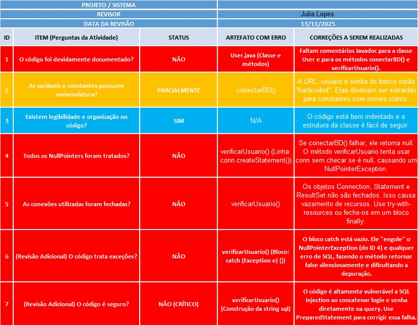
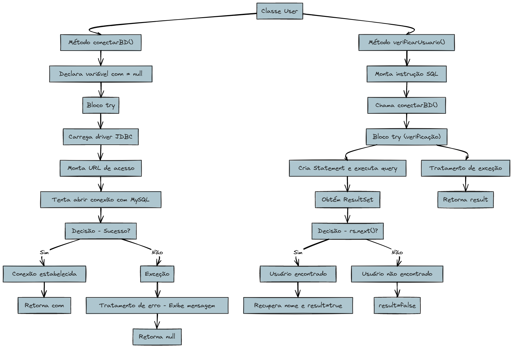
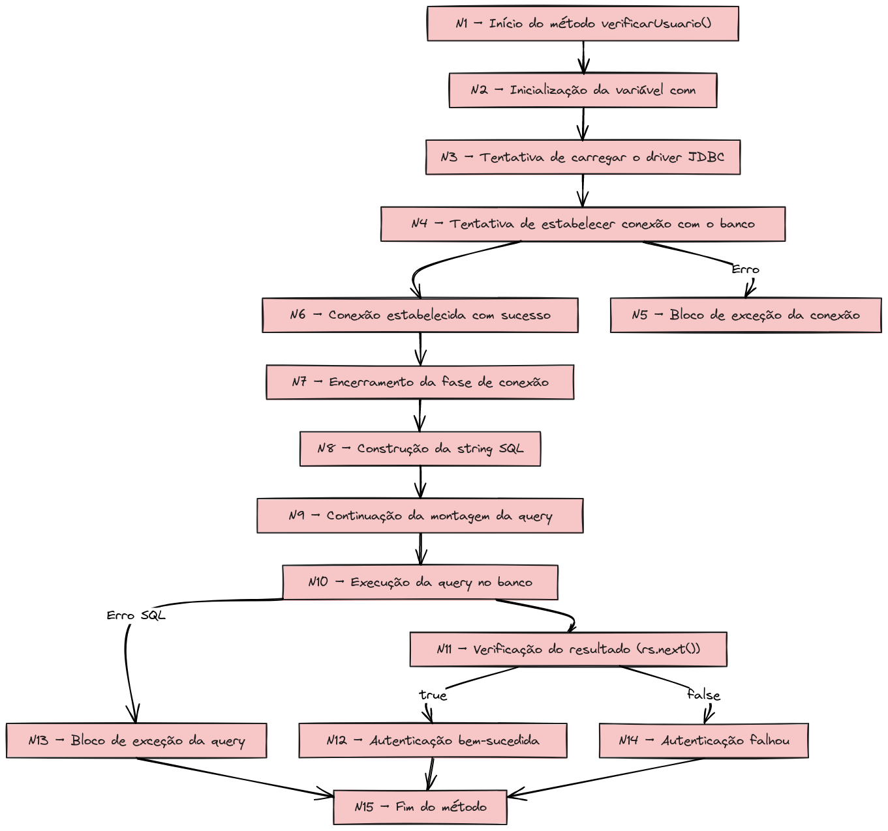

# 🔍 Análise de Caixa Branca – Classe `User` (Java)

Este repositório apresenta a análise completa de **teste de caixa branca** aplicada à classe `User`, utilizada para autenticação e conexão com banco de dados em Java.

A avaliação incluiu: revisão estática, fluxogramas, grafo de fluxo, cálculo da complexidade ciclomática e identificação dos caminhos básicos do método `verificarUsuario()`.

---

## 📂 Arquivos do Repositório

- 📄 Código-fonte: [`users.java`](users.java)
- 📊 Planilha de Revisão: [`planilha.jpg`](planilha.jpg)
- 🧭 Fluxograma Geral: [`fluxo.jpg`](fluxo.jpg)
- 🌸 Fluxograma + Grafo do Método: [`fluxodometodo.jpg`](fluxodometodo.jpg)

---

## 🔎 1. Código Base Analisado

O arquivo [`users.java`](users.java) contém:

### ✔ Método `conectarBD()`
- Carregamento do driver JDBC  
- Conexão com MySQL  
- Retorno da Connection  

### ✔ Método `verificarUsuario()`
- Montagem da SQL  
- Execução da consulta  
- Leitura do ResultSet  
- Retorno booleano de autenticação  

---

## 📋 2. Revisão Estática

Principais pontos encontrados:

- Vulnerabilidade a SQL Injection  
- Possível NullPointerException  
- Recursos JDBC não são fechados  
- Bloco catch vazio  
- Credenciais hardcoded  
- Falta de comentários  

📎 **Planilha:**  

---

## 🧭 3. Fluxograma Geral da Classe

---

## 🌸 4. Fluxograma + Grafo do Método `verificarUsuario()`

---

## 🔢 5. Complexidade Ciclomática

Decisões identificadas:

- Decisão 1 → `try-catch`  
- Decisão 2 → `if (rs.next())`

Fórmula:

\[
M = número\ de\ decisões + 1 = 2 + 1 = 3
\]

✔ **Complexidade Ciclomática = 3**

---

## 🛤️ 6. Caminhos Básicos (Detalhados N1 a N15)

### ✔ Caminho 1 – Usuário encontrado
**N1 → N2 → N3 → N4 → N6 → N7 → N8 → N9 → N10 → N11(true) → N12 → N15**

### ✔ Caminho 2 – Usuário não encontrado
**N1 → N2 → N3 → N4 → N6 → N7 → N8 → N9 → N10 → N11(false) → N14 → N15**

### ✔ Caminho 3 – Fluxo de exceção

#### Variação A – Erro na conexão  
**N1 → N2 → N3 → N4(erro) → N5 → N15**

#### Variação B – Erro na query  
**N1 → N2 → N3 → N4 → N6 → N7 → N8 → N9 → N10(erro) → N13 → N15**

---

## 📘 7. Conclusão

A análise mostrou que, apesar de funcional, o método apresenta:

- vulnerabilidades importantes  
- ausência de fechamento de recursos  
- tratamento inadequado de exceções  
- risco de falhas silenciosas  

Os fluxos e o grafo permitiram mapear todos os comportamentos internos e definir os testes necessários.

---

## 👩‍💻 Autora  
**Julia Carolina do Rosário Lopes**  
ADS – FACENS  
Disciplina: Qualidade e Testes de Software
